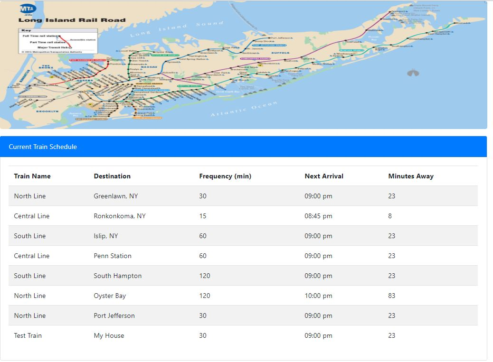
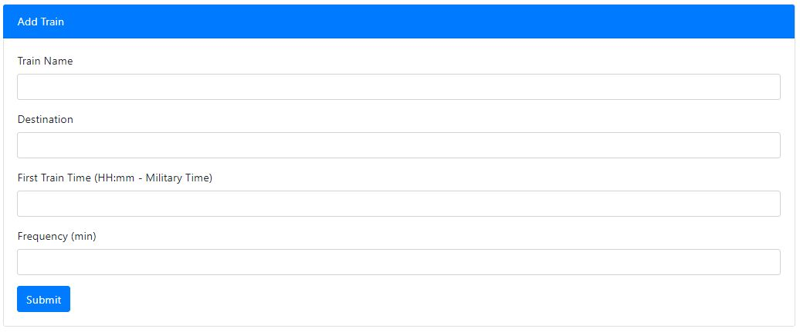

# Train Schedule (LIRR)

Testing capabilities of using firebase as an external database to read/write so that Web App can pull from a db and maintain the most recent state/data as opposed to starting from scratch everytime. 

## Instructions
On load of the page it will automatically pull a snapshot of the data from Firebase.  To add a new train schedule fill in the appropriate from data and click Submit.  This will now be in the Firebase database and display on the screen

## Deployed Application:
https://sthmpsn.github.io/Train-Schedule/

## Technologies
* HTML
* CSS
* Javascript
* jquery
* firebase
* bootstrap
* moment.js
* magnific-popup.js

## Screenshots

## Contributors
* Steve Thompson (sthmpsn)
